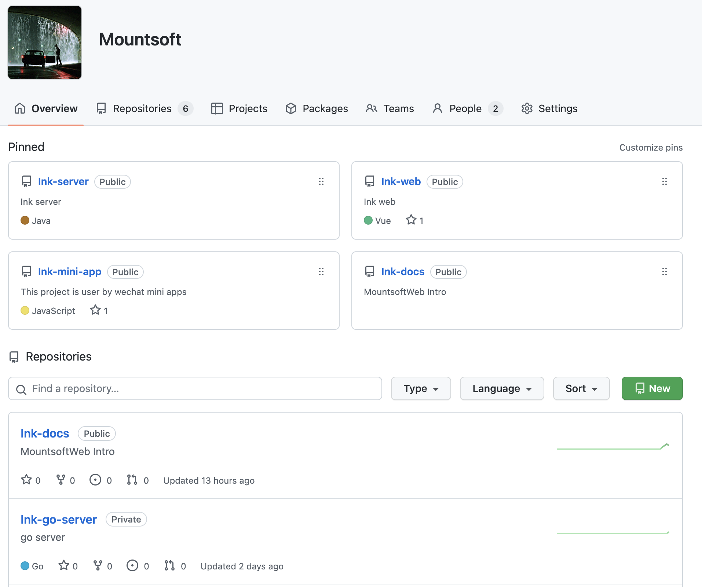

## 技术选择

上一篇介绍，当前计划前后端分离，后端使用 Java + golang 来实现，Java 主要负责管理后台的功能，go 语言负责小程序后端服务支持，前端使用 Vue，结合 element-ui 来实现，因为目前前端我只认识这一个框架，平时和同事们沟通讨论前端框架，大家都是包装都大同小异，没什么特别大的区别，牛逼的还是 Vue。

- Java 使用 Spring 全家桶系列，会的使用，不会的查找资料去使用
- golang 使用 go-zero 框架来实现，这个属于是边学习边开发
- Vue 使用 element-ui，外加 TypeScript 来进行开发
- 小程序模块只在微信端进行开发，其他的目前不考虑，慢慢扩展

## 工具介绍

项目的开始要从环境搭建，服务配置，项目启动。接下来介绍一下目前项目的环境配置，如何运行等问题，后续开发中，如果有变动点，增加服务，会单独编写项目配置更新文档进行介绍。

### 工具准备

- IntelliJ IDEA 进行 Java 服务开发
- vscode 作为 vue, golang, 文档等开发工具
- postman 做接口测试
- Navicat for MySQL 数据库连接工具
- redisdesktop redis 可视化工具

### 语言版本

- Java 18.9
- golang 1.18.3
- nodejs 16.7.0

以上语言版本作为一切服务的基础支持，至于使用框架，构建工具, redis 等版本，可能会随着安全检查，服务升级等因素影响随时变动，如有需要可查看没想服务对应配置文件。

各个配置环境方法网络上有太多的博客介绍，可自行查阅文档进行配置，这里就不进行过多的介绍。

## 仓库介绍

在这篇文章编写的时，仓库目前有六个项目，5 个公开，1 个私有项目，go 语言项目属于私有项目，当前还在学习阶段，起码得是 go-zero 学习得分差不多，能够搭建服务，规划好仓库目录之后，再进行开放。

| 项目名称      | 介绍                                 |
| ------------- | ------------------------------------ |
| Ink-server    | 管理平台服务                         |
| Ink-go-server | go 语言实现的服务                    |
| Ink-docs      | 项目文档仓库                         |
| Ink-web       | Vue 管理平台前端界面                 |
| Ink-mini-app  | 微信小程序                           |
| Ink-cms       | 忘记当初为什么要建立，可能后续会删除 |

基础介绍就到这里，接下来会将项目整体过程，一步步进行记录介绍。希望仓库变得越来越丰富。

代码仓库地址: [MountsoftWeb](https://github.com/mountsoftweb/)

欢迎大家点击查看，觉着有用的话帮忙点个 star ，一起进步，成长！
