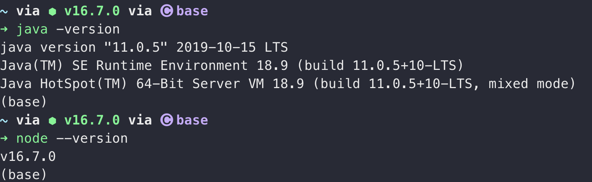
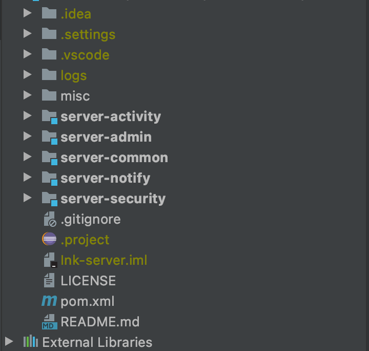
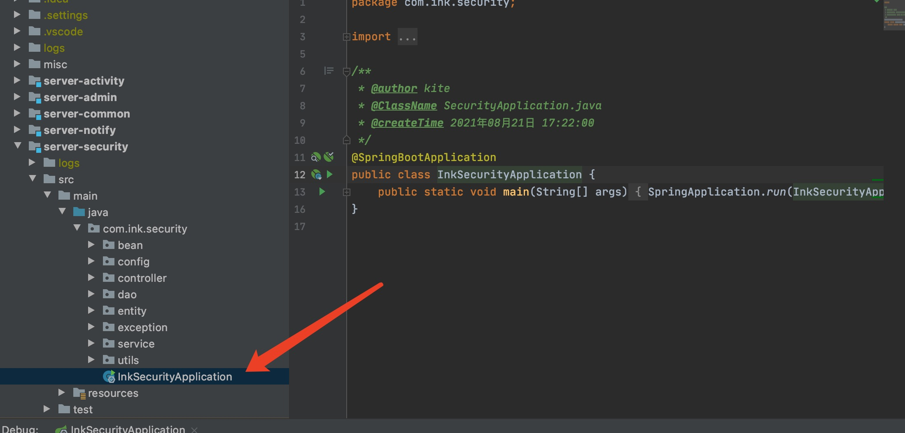
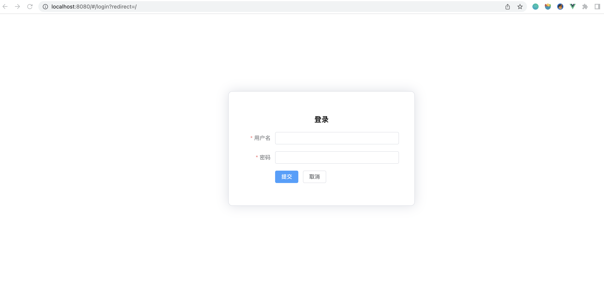

## 后台管理平台

让项目在运行期间更好的进行维护，数据查看，修改，规则配置等情况，需要有一个后台管理模块，也就是被造了无数轮子的 cms 管理系统，在这里也不例外，不就是 CRUD 嘛，玩就是了，闲的也是闲的。

这个模块主要是由它来负责小程序的模块上下限，运行期间的数据查看，运行状态等信息。该项目仓库已经维护一段时间，利用休息的时间，慢慢拼凑，再结合 vue 前台的展示，可以实现简单的用户管理，菜单权限，字典管理功能，随着开发的不断推进，还需要迭代更新。

## 搭建过程

需要具备 Java 1.8+，nodejs 16.7.0 及以上版本，可正常启动运行

### 后端介绍

使用 SpringBoot + SpringCloud 实现微服务，最先没有想过增加 go 语言服务，所以在后台管理的模块设计，使用微服务，每一个小程序功能都看作一个服务，现在比较尴尬，增加 go 语言之后，似乎后台再用微服务似乎没有必要。怎么说呢，没有困难，那就制造困难，也要利用微服务，装也要装一下。

| 模块            | 介绍             | 状态             |
| --------------- | ---------------- | ---------------- |
| server-activity | 流程管理模块     | 待启用           |
| server-admin    | 管理平台业务逻辑 | 待启用           |
| server-common   | 通用模块         | 定义公共参数     |
| server-notify   | 消息处理模块     | 待启用           |
| server-security | 权限处理模块     | 所有角色相关功能 |

整体使用 maven 进行项目构建，修改 pom.xml 对项目所使用 jar 的版本进行维护。分别运行所需要模块下的 Application main 方法，启动服务。再启动之前检查好数据库，redis 等服务域名，端口是否正确。如果端口号冲突，在配置文件内 port 修改端口号即可。

### 前端介绍

项目使用 vue 3.x + TypeScript 进行开发，element-ui 作为前端框架，项目文档比较完善，几乎是可以拿来直接用，写好后端接口，做一些 CRUD 操作没有任何问题。

项目仓库 [Ink-web](https://github.com/MountsoftWeb/Ink-web) 拉取项目到本地，cd 进入项目根目录，依次执行以下命令：

1. npm install
2. npm run server

项目启动之后，可进入 localhost:8080 访问

到此就能够将项目正常启动，目前来看，几乎看不到可玩功能，无非就是如何启动，希望能够借此文档，时时刻刻提醒，要维护下去。功能更加丰富。

代码仓库地址: [MountsoftWeb](https://github.com/mountsoftweb/)

欢迎大家点击查看，觉着有用的话帮忙点个 star ，一起进步，成长！
