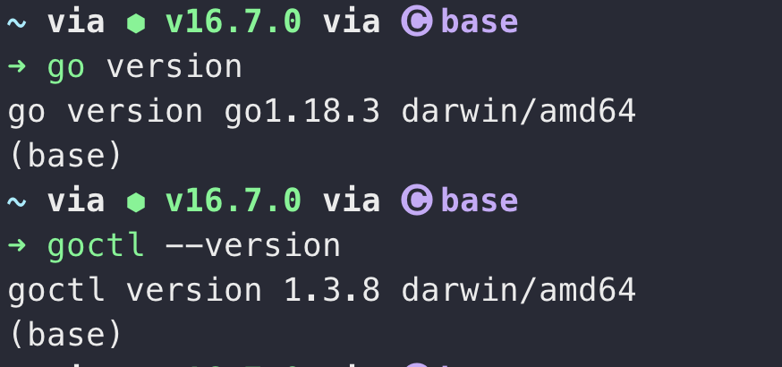

## 小程序

有了管理系统的支撑，就可以进行小程序功能开发，小程序平台选择微信平台，微信有着非常高的使用频率，使用方便，能够快速的找到应用。

很早之前就有注册过属于自己公众号，小程序，一直没有坚持开发下去，这次重新拾起来，就不要丢下，好好维护。要对得起账号找回的这个过程。

## 微信小程序服务

微信小程序界面就按照微信官方提供的模版使用，看着文档特别全，项目代码放到 [Ink-mini-app](https://github.com/MountsoftWeb/Ink-mini-app) 仓库中，跟着小程序官方文档一步步实现。

初步设计首页就是功能模块入口，目前有一个入口（账单）模块入口，需求是共享账单，可多人编辑操作，按月记录，每天记录提醒，月末账单提醒，数据分类统计等功能。

## 小程序后端服务

接到管老师对服务要求，让使用 go 语言进行开发，咱也不知道她懂不懂。摸着黑学习 go 语言及其框架，在工作摸鱼中决定使用 go-zero 框架实现服务端技术支持，初期使用没有像 Java 语言那么熟练的使用，总是在边查询，边使用，例如搭建服务也得利用搜索工具去解决问题。

在 go 语言的学习期间，似乎对之前的编程思维有一个冲击，改变。在 Java 语言环境中，一个方法只能有一个返回值，返回值可以是基本类型，也可以是一个对象，封装一个对象就可以包揽很多的参数字段。这也就造成了 Java 服务开发中会产生许多许多的对象。但是在 go 语言中，方法竟然可以返回两个值，这个是没有想到的事情；go 语言也没有那么重的代码，简洁明了，吸引到我，想要去认识 go 语言。

一个 CRUD 服务，其实没有必要像 SpringBoot 那样多的分层规则，controller,service 这类重复的编码过程，现在应该有的框架是让 CRUD 工作者只关注真正的业务层处理，不需要考虑其他的事情。go-zero 就很好的解决这类问题。

### go-zero 环境

go-zero 提供 goctl 工具增强开发，使用该工具可以直接生成接口代码，rpc 服务代码和数据交互服务代码，通过以上方法，开发就可以只关注底层逻辑交互代码，

#### 安装 goctl

搭建 go-zero 第一步就是安装 goctl 工具，因为我的设备中 go 版本是 1.18.3 可以直接使用 `go install github.com/zeromicro/go-zero/tools/goctl@latest` 进行安装。如果您的 go 版本小于 1.15 需要使用 `GO111MODULE=on go get -u github.com/zeromicro/go-zero/tools/goctl@latest` 进行安装。

下载安装完成后使用 `goctl --version` 命令进行检查，返回如下版本信息后，则表明安装成功。

#### go-zero 开发环境

除了 goctl 工具的安装，在我们的开发过程中，还需要使用插件来更加快捷的进行开发。protobuf 数据结构，goctl 可生成 rpc 服务。

1. protoc https://github.com/protocolbuffers/protobuf，下载解压到$GOPATH/bin下即可，前提是$GOPATH/bin已经加入$PATH中
2. protoc-gen-go 安装方法 `go install google.golang.org/protobuf/cmd/protoc-gen-go@latest`
3. protoc-gen-go-grpc 安装方法 `go install google.golang.org/grpc/cmd/protoc-gen-go-grpc@latest`

如果 goctl 版本大于 1.3.3，可通过 goctl 工具一键安装 `goctl env check -i -f`

代码仓库地址: [MountsoftWeb](https://github.com/mountsoftweb/)

欢迎大家点击查看，觉着有用的话帮忙点个 star ，一起进步，成长！
