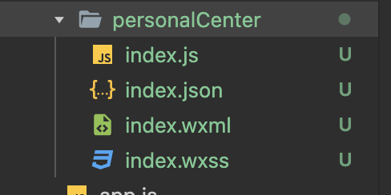
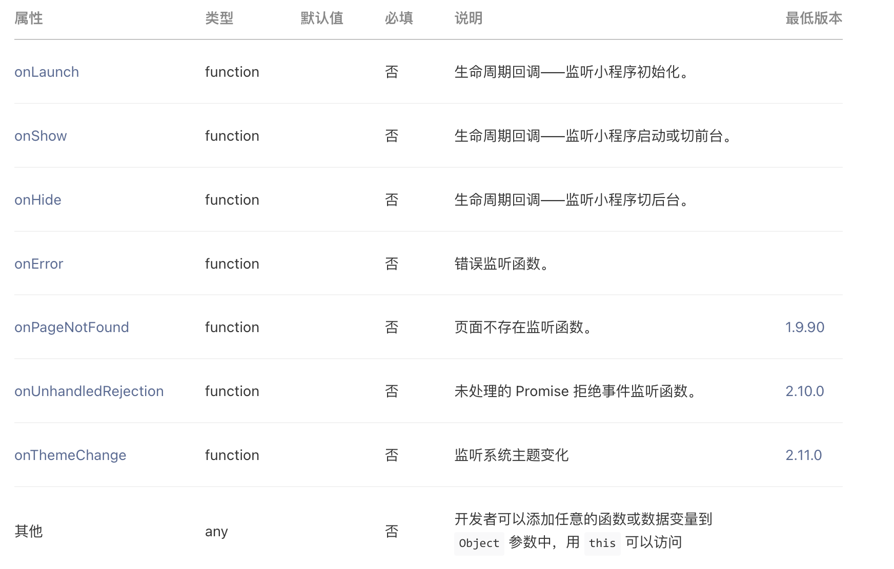

## 项目开始

说干就干，每日工作后，零碎时间自习时间，先学习，再实践。

小程序这块开发，也不找网上视频，就按照官方提供的文档进行开发，在公司摸鱼的时候，浏览一些开源组件，进行调用，就一个目的，快速简单上手进行开发。

小程序的目录结构与 vue 项目结构大同小异，有过 vue 基础之后，看代码更加清晰。先开放两个入口，第一是个人中心，要明确登录的用户是谁，绑定的微信号；第二是账单入口。

根据以上要求，创建目录 个人中心 personalCenter，账单模块 billService。小程序一个路由下，由四个文件进行组成

| 文件名 | 作用       |
| ------ | ---------- |
| wxml   | 页面结构   |
| js     | 小程序逻辑 |
| json   | 公共配置   |
| wxss   | 公共样式表 |

### 用户信息

按照以上文件结构进行创建，首先要拿到当先访问者用户信息，只有授权登录之后，才能对账单以及之后的功能进行权限控制。第一步就要让每一位访问的用户进行授权登录，否则无法进入。后续开发可能放开，当适配权限之后，就需要这么高的要求。

检查用户状态放到 `onLaunch` 监听函数中，该函数用于小程序初始化时触发，全局只触发一次。如果通过分享页打开小程序，首先判断是否有用户状态信息，保证小程序内所有操作都按照用户进行分割。后续可增加用户信息维护字段，例如手机号，邮箱和昵称等信息，更好的提供服务。

下图为微信小程序参数简介

### 账单模块

账单服务算是第一个功能性开发，当用户授权登录之后，可以通过用户唯一标识找到对应账单信息，提供两个入口第一是用户信息，第二就是账单服务；账单界面，默认按照月进行统计展示。第一期接口 CRUD 账单，账单表，账单用户表，账单备份表等信息。
