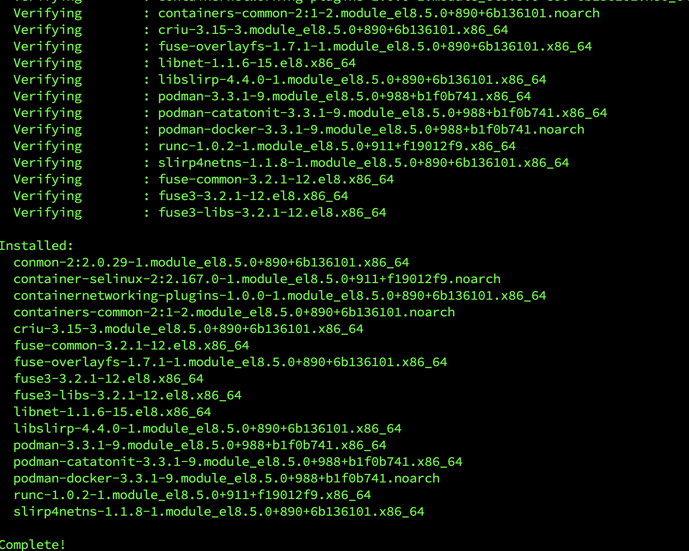
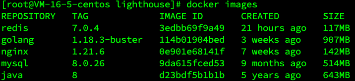

## 服务器选择

查找了阿里云，百度云和腾讯云，对比了这几家服务价格，活动，因为现在不是学生身份，无法购买学生优惠，选择服务器只要够规格，就选最便宜的，使用腾云服务器，2 核 4g 60g，目前服务来看，够自己玩，后续不够再增加预算。

## 环境配置

云服务器付款之后，第一步就是配置运行环境，java, golang, node.js 等等，不想一个个找博客，找资料装下去，太费事了，装了自己又记不住，等部署新环境，还得搞一遍。准备直接使用 docker 进行环境配置。

### 安装 docker

云服务器是 Centos8.2，按照 docker 描述，符合版本安装要求，使用 yum 进行 docker 安装。

```
yum remove docker \
                  docker-client \
                  docker-client-latest \
                  docker-common \
                  docker-latest \
                  docker-latest-logrotate \
                  docker-logrotate \
                  docker-engine
yum install -y yum-utils
 #安装yum-utils，因为utils提供了yum-config-manager能力

yum-config-manager --add-repo http://mirrors.aliyun.com/docker-ce/linux/centos/docker-ce.repo
 #安装国内的仓库保证我们后续下载docker中的各个应用可以快速执行，因为从国外的镜像下载实在太慢了

yum install docker-ce docker-ce-cli containerd.io docker-compose-plugin

#安装最新的docker engine
systemctl start docker
# 启动docker
docker run hello-world

开机自启 docker
systemctl enable docker
```



### 配置镜像

服务器下载特别的慢，所以首先要配置镜像，可以加快速度，减少等待时间。

```
# 中科大
https://docker.mirrors.ustc.edu.cn
# 腾讯云
https://mirror.ccs.tencentyun.com
```

- linux /etc/docker/daemon.json
- mac /Users/xxx/.docker/daemon.json
- win C:\Users\xxx\.docker\daemon.json

修改相应配置文件

```json
{
  "registry-mirrors": ["https://mirror.ccs.tencentyun.com"]
}
```

重启服务

```shell
sudo systemctl daemon-reload
sudo systemctl restart docker
```

### 配置 Java, golang

目前我开发使用 Java 版本为 1.8，所以在下载镜像的时候，需要指定版本号，不让默认会下载最新版本。使用 docker 进行安装。

```
docker pull docker.io/java:8
运行镜像
docker run -it --name java-jdk8 -d docker.io/java:8
```

本地开发使用 go 版本为 1.18.3 找到对应的版本为 1.18.3-buster

```
docker pull golang:1.18.3-buster

运行镜像
docker run -it --name go-go118 -d docker.io/golang:1.18.3-buster

go env -w GO111MODULE=on #开启go mod
go env -w GOPROXY="https://goproxy.cn"
go env -w GOPATH="/go"  #如果本身就是，那就不需要再改了，可以省略


docker run -itd -p 8080:8080 \
-v /Users/jay/go/project:/go -\
-name golang-1.18.3 golang-local


```

### 配置 nginx

nginx 版本为 1.21.6

```
docker pull nginx:1.21.6

nginx 挂载目录，主机创建 nginx 目录，配置文件
mkdir -p /nginx/conf
mkdir -p /nginx/log
mkdir -p /nginx/html


# 生成容器，先进入 nginx ,检查是否启动
docker run --name nginx -p 9001:80 -d nginx:1.21.6
# 将配置文件挂载到 宿主机
docker cp -a mynginx:/etc/nginx/ /usr/local/nginx/conf

# 将容器nginx.conf文件复制到宿主机
docker cp nginx:/etc/nginx/nginx.conf /home/nginx/conf/nginx.conf
# 将容器conf.d文件夹下内容复制到宿主机
docker cp nginx:/etc/nginx/conf.d /home/nginx/conf/conf.d
# 将容器中的html文件夹复制到宿主机
docker cp nginx:/usr/share/nginx/html /home/nginx/

docker run \
-p 80:80 \
--name nginx \
-v /home/nginx/conf/nginx.conf:/etc/nginx/nginx.conf \
-v /home/nginx/conf/conf.d:/etc/nginx/conf.d \
-v /home/nginx/log:/var/log/nginx \
-v /home/nginx/html:/usr/share/nginx/html \
-d nginx:1.21.6
```

### 配置 MySQL. redis

数据存储服务使用 MySQL 8.0.26，端口映射到主机

```
docker pull mysql:8.0.26

创建挂载目录
mkdir -p /mysql/log
mkdir -p /mysql/data
mkdir -p /mysql/conf

 sudo docker run \
 -–restart=always\
 -p 3306:3306 --name mysql \
 -v /mydata/mysql/log:/var/log/mysql \
 -v /mydata/mysql/data:/var/lib/mysql \
 -v /mydata/mysql/conf:/etc/mysql \
 -e MYSQL_ROOT_PASSWORD=root \
 -d mysql:8.0.26

```

redis 服务虽然在目前还没有使用，相信这个一定有用武之地，redis 先安装最新版本，同样需要挂载目录。

```
docker pull redis:7.0.4

创建挂载目录
mkdir -p /redis/localredis.conf
mkdir -p /redis/data

docker run --restart=always \
--log-opt max-size=100m \
--log-opt max-file=2 \
-p 6379:6379 --name reids \
-v /home/redis/myredis/myredis.conf:/etc/redis/redis.conf \
-v /home/redis/myredis/data:/data \
-d redis:7.0.4 redis-server /etc/redis/redis.conf  \
--appendonly yes  \
--requirepass 000415

```



docker 官方镜像仓库找对应版本
https://hub.docker.com/

代码仓库地址: [MountsoftWeb](https://github.com/mountsoftweb/)

欢迎大家点击查看，觉着有用的话帮忙点个 star ，一起进步，成长！
