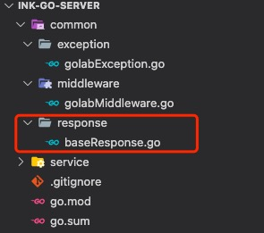
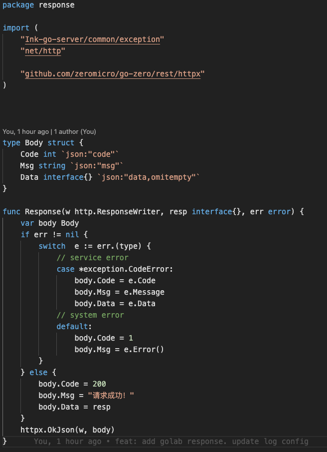
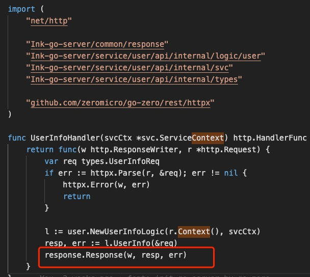
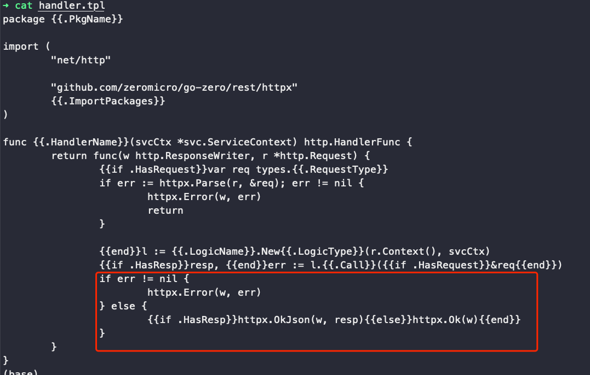

## 配置统一返回结构

程序后端服务由 golang 支持，使用开源服务框架 go-zero。基础服务搭建已完成，但是有一个问题，现在 go 语言，与 Java 语言的返回体不太一样。go-zero 提供的基础返回体是直接返回实例，可能是一个 json ，也可能是一个字符串。我们需要有一个返回体规范，这样方便小程序，前端进行解析处理。

### 定义返回体

按照 Java 服务搭建的返回体，设置统一结构如下

```
{
    "code": 200,
    "msg": "message"
    "data": object
}
```

### go-zero 配置

框架使用，创建一个公共模块，放到 service 同级目录，common 目录下放置所有公共调用类，各个模块均可引用。


#### 创建返回体

在公共目录下创建 response 返回体 struct。完整的返回体由正常信息与异常信息组成，如果有异常信息调用，需要解析处理。在这里增加了自定义异常捕获，区分系统异常。使用自定义异常信息，可以清晰判断异常类型，服务异常能够快速定位。


模块服务的 handle 中进行修改，将原有返回体删除，替换为自定义返回结构，代码示例如下。


通过以上配置，服务就可以有一个公共的返回体。上述过程是手动进入 hadnle 进行改变，如果接口很多，这样的方法并不推荐，太费事，重复性工作很多。这不是使用 go-zero 的初衷。所以我们要进行调整，将源头改变，服务 api 是由 goctl 进行生成，只要找到对应的生成 handle 模版，进行修改，这样之后每次 init api 服务的时，都可以按照最新模版进行创建 handle。

#### 修改 goctl handle 模版

打开命令行工具，执行 `goctl template init`，作用是将模版文件初始化到电脑本地目录，可以针对性修改模版文件。开发中使用 mac 电脑，模版路径在 `~/.goctl/version/`，找到 handle.tpl 文件。方框中是 go-zero 官方提供的模版方法，将其删除，更换为 ` {{if .HasResp}}response.Response(w, resp, err){{else}}response.Response(w, nil, err){{end}}//②`，注意头部 import 也要添加对应 response 路径。


执行完成上述操作，就可以使用自定义返回结构体。后续新生成的 api 服务都会按照模版进行创建。

补充：win 开发机找配置文件，在用户目录下找到隐藏目录 `.goctl`

代码仓库地址: [MountsoftWeb](https://github.com/mountsoftweb/)

欢迎大家点击查看，觉着有用的话帮忙点个 star ，一起进步，成长！
