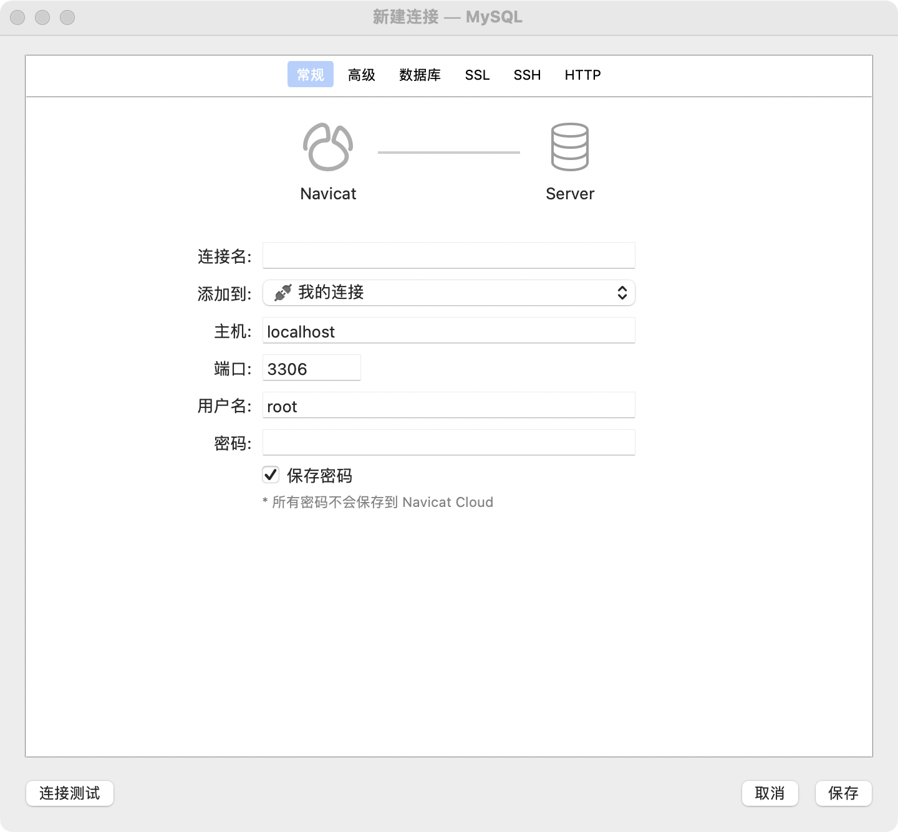
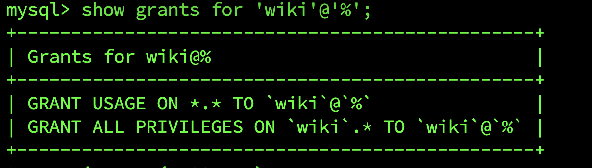

## 服务器 MySQL

之前我们已经通过 dokcer 在服务器中安装 MySQL(8.0.26)。并且创建账户与数据库，但是在维护中，只能是通过服务器登录，想要通过可视化界面进行数据库操作，毕竟那么多指令，长时间不使用总会忘记。

### Navicat MySQL 连接

开发机中使用 Navicat 工具进行连接，无法直接通过 ip + port 进行连接，云服务器设置防火墙，有一些安全策略，所以第一步需要通过腾讯云管理界面，将 MySQL 端口进行开放。我认为也不需要直接开放 MySQL 端口，可以通过 nginx 反向代理，配置好域名解析，也是可以操作，后续如果更新 nignx 域名解析方法，再更新该文档。

#### Navicat 登录用户

配置我们的主机地址，端口，用户名密码。


#### MySQL 8 配置

但是在 MySQL 8 版本之后， 远程连接方式有所改变，需要单独配置。登录服务器地址，进入 docker MySQL 运行环境。

```
mysql -u root -p
# 进入 MySQL

use mysql;

show tables;

select Host, User from user;

# 查看 user 表信息，查看我们开放的用户登录，Host 是否为 % 如果不是，需要使用 update 进行更新
update user set Host='%' where User  = '账户';

# 修改密码
ALTER USER '用户'@'%' IDENTIFIED WITH mysql_native_password BY '密码';

# 刷新
flush privileges;
```

配置 MySQL 完成之后，我们就可以在开发机中使用 Navicat 工具进行操作。

### MySQL 用户

可以进行远程登录，每一个操作人员只要是知道地址，账户密码信息就可以进行操作，权限开放的太多，不利于后续管，所以在初步搭建时，就应该将所有涉及用户信息等都进行考虑，要有安全意识。

要为每一个 MySQL 账户分配对应的读写权限，一定要做到权限细分。不论我们的服务体积大还是体积小，这些基础支持服务一定是先行。

例如最简单的就是禁止 `root` 用户进行远程登录。如果服务使用数据库，可创建所属用户，授权操作数据库。并且这一系列操作过程都要有文档记录维护。要精确到每一位用户权限细分。

#### MySQL 用户创建，维护

在授权与收权操作，都需要 `root` 用户在机器上执行命令进行操作，掌握基本的用户维护语句是必须具备。

```
# 用户创建及远程连接
create user '用户'@'localhost' identified by '密码';
create user '用户'@'%' identified by '密码';
alter user '用户'@'%' identified with mysql_native_password by '密码';
```

#### 用户授权，收权

在 MySQL 中用户权限分为四个等级：

1. 全局，可以管理整个数据库，root 权限，这个不可远程连接
2. 数据库，可按照服务使用数据库，分配不同权限
3. 数据表，指定数据库，数据表，同数据库一样按照服务区分
4. 字段，表内字段，属于最细权限划分

   对应 mysql 库中 `user,db,tables_priv,columns_priv,procs_priv`

权限对应表
权限|设置权限
-----|-----
表权限|Select, Insert, Update, Delete, Create, Drop, Grant, References, Index, Alter
列权限|Select, Insert, Update, References
过程权限|Execute, Alter Routine, Grant

关于连接方式，上面内容已做介绍，这里主要是操作用户权限数据库。

查看用户权限信息。例如 `wiki` 用户，创建时是赋予所有权限，按照图中展示，wiki 用户有 wiki 数据所有操作权限。

`show grant for '用户'@'%'`



##### 授权 grant

授权语句，数据库.\* 可赋值对应数据库内所有数据表权限。
`grant 权限,权限 on 数据库.数据表 to '用户'@'Host'`

##### 收权 revoke

收权，也称为撤销权限，只是我喜欢叫做收权，个人喜好吧。

`revoke 权限 on 数据库.数据表 from '用户'@'Host'`

需要授权的权限可通过查权语句查看，收回对应的权限。

代码仓库地址: [MountsoftWeb](https://github.com/mountsoftweb/)

欢迎大家点击查看，觉着有用的话帮忙点个 star ，一起进步，成长！
